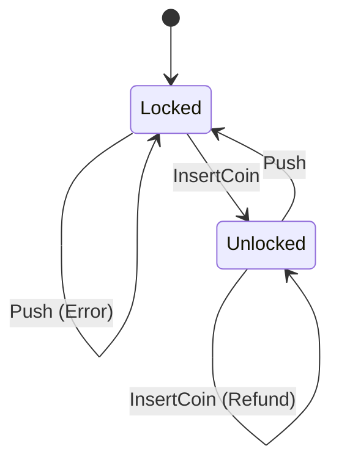
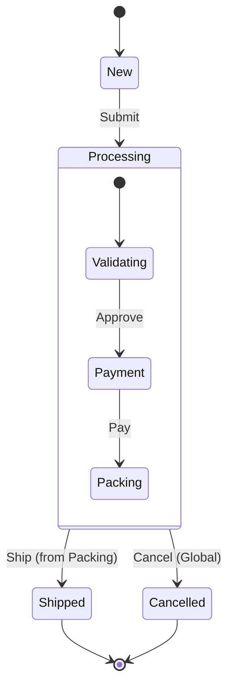

# NextMachina - Functional Hierarchical State Machine Library

A lightweight and flexible C# library for implementing hierarchical state machines. It offers a fluent API (DSL) to define states, transitions, and actions.

## Features

*   **Hierarchical States**: Support for composite states (sub-states) with initial state management.
*   **Fluent DSL**: Clear and readable state machine definition.
*   **Actions**: Support for `OnEntry`, `OnExit`, and `OnState` actions.
*   **Conditional Transitions**: Definition of guards (`When`) to control transitions.
*   **Generic**: Strong typing for States, Inputs, and Outputs.

## Installation

The project is a .NET standard solution. You can integrate it directly into your solution or reference the `NextMachina` project.

## Usage Examples

### 1. Simple State Machine: Turnstile

This example models a simple turnstile that can be Locked or Unlocked.

#### Diagram



#### Code

```csharp
using NextMachina.Engine;
using static NextMachina.Dsl.StateMachineDsl<TurnstileState, TurnstileInput, string>;
using static NextMachina.Dsl.TransitionState<TurnstileState, TurnstileInput>;

public enum TurnstileState { Locked, Unlocked }
public enum TurnstileInput { InsertCoin, Push }

var turnstileMachine = StateMachine(initialState:TurnstileState.Locked)
    .State(TurnstileState.Locked)
        .Transitions(
            To(TurnstileState.Unlocked).When(input => input == TurnstileInput.InsertCoin)
        )
        .OnEntry(_ => "Locked")
    .State(TurnstileState.Unlocked)
        .Transitions(
            To(TurnstileState.Locked).When(input => input == TurnstileInput.Push)
        )
        .OnEntry(_ => "Unlocked")
    .BuildDefinition()
    .Create();

// Usage
var (newState, outputs) = turnstileMachine.TransitionFrom(TurnstileState.Locked, TurnstileInput.InsertCoin);
// newState is TurnstileState.Unlocked
```

### 2. Hierarchical State Machine: Order Processing

This example demonstrates composite states. The `Processing` state contains sub-states (`Validating`, `Payment`, `Packing`). A transition from the parent state `Processing` (e.g., `Cancel`) applies to all its sub-states.

#### Diagram



#### Code

```csharp
using NextMachina.Engine;
using static NextMachina.Dsl.StateMachineDsl<OrderState, OrderEvent, string>;
using static NextMachina.Dsl.TransitionState<OrderState, OrderEvent>;

public enum OrderState 
{ 
    New, 
    Processing, 
        Validating, 
        Payment, 
        Packing, 
    Shipped, 
    Cancelled 
}

public enum OrderEvent { Submit, Approve, Pay, Packed, Ship, Cancel }

var orderStateMachine = StateMachine(initialState:OrderState.New)
    .State(OrderState.New)
        .Transitions(
            To(OrderState.Processing).When(evt => evt == OrderEvent.Submit)
        )
    
    // Composite State: Processing
    .State(OrderState.Processing)
        // Global transition: If 'Cancel' is received while in ANY sub-state of Processing, go to Cancelled
        .Transitions(
            To(OrderState.Cancelled).When(evt => evt == OrderEvent.Cancel)
        )
    
    // Sub-states of Processing
    .State(OrderState.Validating).InitialSubStateOf(OrderState.Processing)
        .Transitions(
            To(OrderState.Payment).When(evt => evt == OrderEvent.Approve)
        )
    .State(OrderState.Payment).SubStateOf(OrderState.Processing)
        .Transitions(
            To(OrderState.Packing).When(evt => evt == OrderEvent.Pay)
        )
    .State(OrderState.Packing).SubStateOf(OrderState.Processing)
        .Transitions(
            To(OrderState.Shipped).When(evt => evt == OrderEvent.Ship)
        )
        
    .State(OrderState.Shipped)
    .State(OrderState.Cancelled)
    .BuildDefinition()
    .Create();

// Usage Scenario 1: Normal Flow
// New -> Processing (enters Validating)
var (s1, _) = orderStateMachine.TransitionFrom(OrderState.New, OrderEvent.Submit); 
// s1 is OrderState.Validating

// Validating -> Payment
var (s2, _) = orderStateMachine.TransitionFrom(s1, OrderEvent.Approve);
// s2 is OrderState.Payment

// Usage Scenario 2: Cancellation from sub-state
// Assume we are in Payment state
// Payment -> Cancelled (handled by parent Processing state)
var (s3, _) = orderStateMachine.TransitionFrom(OrderState.Payment, OrderEvent.Cancel);
// s3 is OrderState.Cancelled
```

## Project Structure

*   `src/`: Source code of the library.
    *   `Dsl/`: Implementation of the Domain Specific Language for configuration.
    *   `Engine/`: Execution engine of the state machine.
    *   `Definitions/`: Data structures defining the state graph.
*   `tests/`: Unit tests (NUnit) demonstrating various use cases (composite states, transitions, etc.).

## Contributing

Contributions are welcome. Make sure all tests pass before submitting a Pull Request.

```bash
dotnet test
```
